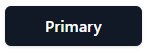
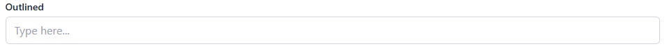
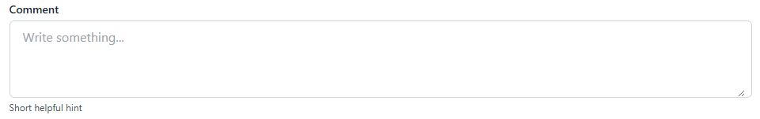
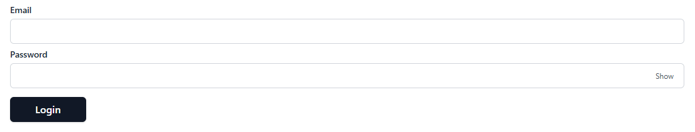

# Feather UI

A lightweight, customizable React component library built with **Tailwind CSS**.  
Provides accessible, theme-ready UI primitives like buttons, loaders, and more.

[](https://www.npmjs.com/package/@chaithanya-kumar-katta/feather-ui)
[](https://www.npmjs.com/package/@chaithanya-kumar-katta/feather-ui)
[](LICENSE)

---

## ✨ Features

- ⚡ Simple React components with sensible defaults
- 🎨 Fully customizable via CSS variables or Tailwind
- 🧩 Works out-of-the-box with **React 18+ / 19+**
- 🔒 Accessible by default
- 📦 Tree-shakable & ESM/CJS builds

---

## 📦 Installation

```bash
# with npm
npm install @chaithanya-kumar-katta/feather-ui

# or with yarn
yarn add @chaithanya-kumar-katta/feather-ui

# or with pnpm
pnpm add @chaithanya-kumar-katta/feather-ui
```

## 🚀 Usage

Import the components you need:

```tsx
import React from "react";
import { Button } from "@chaithanya-kumar-katta/feather-ui";
import "@chaithanya-kumar-katta/feather-ui/dist/feather-theme.css";
// required if not auto-imported

export default function App() {
  return (
    <div className="p-4">
      <Button variant="primary" size="md">
        Click Me
      </Button>
    </div>
  );
}
```

## With Icons

Feather UI supports passing any ReactNode as an icon:

```tsx
import { Plus } from "lucide-react";
import { Button } from "@chaithanya-kumar-katta/feather-ui";

<Button variant="success" icon={<Plus size={18} />}>
  Add Item
</Button>;
```

## Loading State

```tsx
<Button variant="primary" loading>
  Saving...
</Button>
```

## Block (full width)

```tsx
<Button variant="danger" block>
  Delete
</Button>
```

## 🎨 Theming

Feather UI exposes CSS variables you can override to fit your brand.

Default variables (:root):

```css
:root {
  --color-primary-500: #3b82f6;
  --color-danger-500: #ef4444;
  --color-success-500: #22c55e;
  --color-warning-500: #eab308;
  --color-gray-500: #6b7280;
}
```

Override them in your own CSS:

```css
:root {
  --color-primary-500: #7c3aed; /* purple */
  --color-danger-500: #f43f5e; /* rose */
}
```

Or set them programmatically:

```ts
import { setFeatherTheme } from "@chaithanya-kumar-katta/feather-ui";

setFeatherTheme({
  "--color-primary-500": "#7c3aed",
  "--color-danger-500": "#f43f5e",
});
```

## 📚 Components

Currently included:

### Button



### Input



### Textarea



### Form



More components coming soon!

🤝 Contributing
Contributions, issues and feature requests are welcome!
Feel free to open a PR or start a discussion.

## 📄 License

MIT © 2025 Chaithanya Kumar
